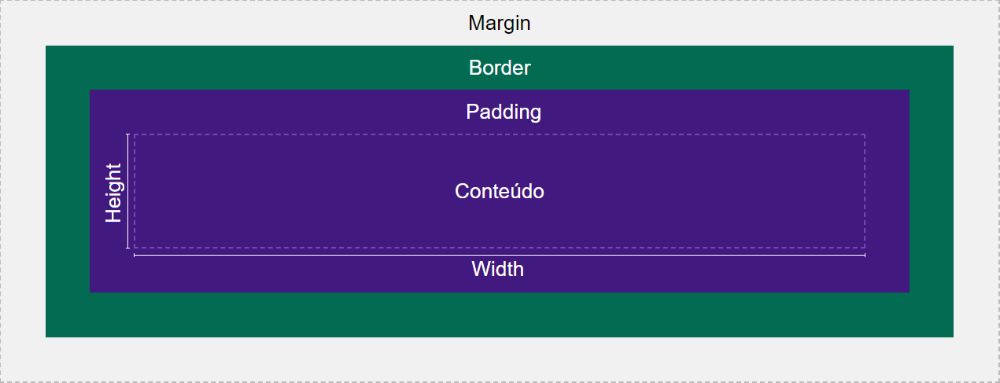

# Conhecimentos básicos de HTML E CSS

- Para iniciar um "esqueleto" de página HTML padrão, basta começar a digitar "html:5" no arquivo html e teclar ENTER.

O conteúdo criado será algo como : 

    <!DOCTYPE html>
    <html lang="en">
    <head>
      <meta charset="UTF-8">
      <meta http-equiv="X-UA-Compatible" content="IE=edge">
      <meta name="viewport" content="width=device-width, initial-scale=1.0">
      <title>Document</title>
    </head>
    <body>
      
    </body>
    </html>

## Elementos block e inline [ DISPLAY ]
- Elementos block:

  <strong> div, section, article, nav, ul, li, header, p, etc...</strong>

  - Ocupam 100% da largua do elemento pai;
  - Ocupam a própria linha, sendo posicionads abaixo do elemento anterior;
  - A altura padrão é definida pelo tamanho do conteúdo;
  - É possível altear as propriedades de tamanho e largura;
  - É possível alterar todas as propriedade de margem;

- Elementos inline:

  <strong> a, span, b, i, etc...,</strong>

  - Ocupam a largura do próprio conteúdo;
  - Dois ou mais elementos inline em sequência, são posicionados lado a lado;
  - Não é possível alterar as propriedade de alura e largura;
  - Somente é possível alterar as margens horizontais;
  - Ao aplicar float, automaticamente se tranformam em elementos block;
  - Se comporta como um texto.

- Elementos inline-block:
  - Ocupam a largura do próprio conteúdo;
  - Dois ou mais elementos inline-block em sequência são posicionados lado a lado;
  - É possível alterar as propriedades de tamanho e largura;
  - É possível alterar todas as propriedades de margem.

## Elementos semânticos

- [header](https://developer.mozilla.org/en-US/docs/Web/HTML/Element/header) : O elemento header representa um cabeçalho contendo texto introdutório.

- [nav](https://developer.mozilla.org/en-US/docs/Web/HTML/Element/nav) : O elemento nav representa um conjunto de links de navegação. 

- [aside](https://developer.mozilla.org/en-US/docs/Web/HTML/Element/aside) : O elemento aside representa um conteúdo à parte. Alguns exemplos de sua utilização são: barras laterais e/ou conteúdos adjacentes à um conteúdo principal.

- [article](https://developer.mozilla.org/en-US/docs/Web/HTML/Element/article) : O elemento article representa um conteúdo autocontido. Ou seja, todo o conteúdo presente dentro de um article provê as informações necessárias para sua compreensão, podendo ser reusado em outras páginas.

- [section](https://developer.mozilla.org/en-US/docs/Web/HTML/Element/section) : O elemento section representa uma seção do documento, agrupando conteúdos relacionados.

- [footer](https://developer.mozilla.org/en-US/docs/Web/HTML/Element/footer) : O elemento footer representa o rodapé do documento e/ou de uma seção.

## Formulários

### Form

A tag **<form/ >** é a forma de integração do usuário com o sistema web, para coletar e trabalhar com dados.

A tag possui algumas propriedades importantes tais como:
- **action:** Serve para indicar onde as informações serão enviadas como outro página html;
- **method:** Serve para indicar o método http que irmemos utilizar (**GET** ou **POST**):
  - **GET**: Os dados enviados serão enviados através da URL da página
  - **POST**:  Os dados são enviados de forma "mais escondida" para outro ambiente sem ser pela URL.

        <form action="" method="GET">

- **enctype:** Esse atributo é utilizado quando no método POST, se deseja enviar algum arquivo, não apenas texto.
      
      <form enctype="multipart/form/data" />

### Labels

Os elementos <label/ > são "etiquetas" para acompanhar cada input do formulário, com eles é possível selecionar o input, clicando em qualquer área do mesmo como exemplo e seus nomes. 

Possui como propriedade o ***"htmlfor"*** ou ***"for"*** (react ou html puro) que deve conter o name ou id do input a que faz referência.
### Inputs

Na criação de formuçários se faz necessária a criação dos campos específicos para inserção das informações a serem trabalhadas. Dessa forma, as tags <input/ > possuem alguns ***tipos*** e ***atributos***:

#### **Types**
- **button:** define um botão;
- **checkbox:** permite que a pessoa usuária selecione ZERO ou MAIS opções de um número limitado de escolhas;
- **color:** campos de entrada que devem conter uma cor para selecionar;
- **date:** campos de entrada que devem conter uma data;
- **datetime-local:** campo de entrada de data e hora, sem fuso horário;
- **email:** campos de entrada que devem conter um endereço de e-mail;
- **file:** campo de seleção de arquivo e um botão “Procurar” para uploads de arquivos;
- **month:** permite que a pessoa usuária selecione um mês e ano;
- **number:** define um campo de entrada numérico;
- **password:** os caracteres do campo de senha são mascarados (mostrados como asteriscos ou círculos);
- **radio:** permite que uma pessoa usuária selecione APENAS UMA de um número limitado de opções;
    - O atributo de seleção dos ***radios*** é **checked** e não ***selected.***
- **range:** define um controle para inserir um número (como um controle deslizante). Intervalo padrão é de 0 a 100;
- **reset**: redefinirá todos os valores do formulário para seus valores padrão;
- **search:** usado para campos de pesquisa;
submit: envia dados de formulário a um manipulador de formulários (especificado na action do form);
- **tel:** campos de entrada que devem conter um número de telefone;
- **text:** campo de entrada de texto de linha única;
- **time:** permite que a pessoa usuária selecione um horário (sem fuso horário);
- **url:** campos de entrada que devem conter um endereço URL;
- **week:** permite à pessoa usuária selecionar uma semana e um ano.

#### Atributos
- **name:** identifica o input e dá nome ao campo ao colocar um alor - é o nome definido aqui que irá aparacer na URL ao submeter o formulário. 
- **value:** especifica um valor inicial para um campo de entrada;
- **readonly:** especifica que um campo de entrada é somente leitura;
- **disabled:** especifica que um campo de entrada deve ser desativado;
- **size:** especifica a largura visível, em caracteres, de um campo de entrada;
- **maxlength:** especifica o número máximo de caracteres permitidos em um campo de entrada;
- **min e max:** especificam os valores mínimo e máximo para um campo de entrada;
- **multiple:** especifica que a pessoa usuária tem permissão para inserir mais de um valor em um campo de entrada;
- **pattern:** especifica uma expressão regular em relação à qual o valor do campo de entrada é verificado;
- **placeholder:** especifica uma dica curta que descreve o valor esperado de um campo de entrada;
- **required:** especifica que um campo de entrada deve ser preenchido antes de enviar o formulário - mostra uma mensagem de erro ao se tentar submeter o formuário sem o campo com esse atributo prenchido;
- **step:** especifica os intervalos de números válidos para um campo de entrada;
- **autofocus:** especifica que um campo de entrada deve obter foco automaticamente quando a página é carregada;
- **height e width:** especificam a altura e a largura de um elemento;
- **autocomplete:** especifica se um campo de entrada deve ter o preenchimento automático ativado ou desativado.

### Textarea
A tag <textarea/ > possibilita a criação de caixas de texo e tem como atributospassíveis de configuração o número de linhas e colunas:
- **cols:** número de colunas;
- **rows:** número de linhas;

### Button (submit)

O botão do tipo **submit** possui como **comportamento padrão** o envio das informaçẽos do formulário e atualização da página. Para evitar tal comportamento se faz necessário a adição do atributo/função ***preventDefault().***

# Estilização com CSS

<strong>[DOCUMENTAÇÃO CSS](https://www.w3schools.com/css/default.asp) </strong>

- Para iniciar uma estilização existem 3 maneiras conforme a <strong>[documentação](https://www.w3schools.com/css/css_howto.asp) </strong>: 

  - CSS externo;
  - CSS interno e;
  - CSS inline.

  Para a configuração do CSS interno, basta criar dentro do componente < head > um componente < style> </ style> e dentro dele fazer as configurações de estilização do CSS da seguinte forma: 

    <strong>elemento a ser estilizado {

    atributo: valor;

    } </strong>

    Exemplo: 

      

👀 Observação: A boa prátca indica o uso da estilização com o CSS externo. Para isso adicionar a seguinte linha no componente < head>  do HTML com href apontando para o arquivo css criado.

      <link rel="stylesheet" href="mystyle.css">

## Box model

  
## Agrupando seletores

Para agupar seletores e defini-los com as mesmas propriedades, basta separa-los com uma virgula:

Exemplo: 

    h1, h2 {
      font-family: monospace;
    }

## Selecionando determinado elemento dentre vários de um mesmo tipo

- Para se atribuir estilos diferentes a elementos de um mesmo tipo, sem que para isso seja necessária a utilização de classes ou ids, tem-se a seguinte fórmula:

  - elemento:nth-of-type(number) {
    
    }

Exemplo: 

    div:nth-of-type(3) {
      background-color: red
    }

    Esta solução estará aplicando o background vermelho à terceira div encontrada no documento.

👀 De forma similar você pode buscar pelos filhos do elemento de forma específica, conforme segue: 

    div:nth-child(odd) > h3{
      font-style: italic;
    }
  
    Bônus: Na forma acima buscamos pelos filhos ímpares do elemento (even or odd)

## Descendencia e combinação de Seletores

Para fazer atribuições específica dos elementos é recomendado a leitura da <strong> [documentação de referência](https://developer.mozilla.org/en-US/docs/Web/CSS/Adjacent_sibling_combinator).</strong>

## Pseudo-classes

- Uma pseudo-classe CSS é uma palavra-chave adicionada a seletores que especifica um estado especial do elemento selecionado.

<strong>[Documentação de pseudo-classes](https://developer.mozilla.org/pt-BR/docs/Web/CSS/Pseudo-classes)</strong>

## Frameworks CSS

**[Bootstrap](https://getbootstrap.com/)**

**[Popper](https://popper.js.org/)**

**[Bulma](https://bulma.io/)**

**[Semanti UI](https://semantic-ui.com/)**

**[Highcharts](https://www.highcharts.com/)**

**[Materializecss](https://materializecss.com/cd)**

# [CSS FLEXBOX](CSS-Flexbox.md)

# Aplicando JavaScript nas paginas HTML

## JavaScript: DOM, Eventos e Web Storage

<strong>[DOCUMENTAÇÃO COMPLETA](https://www.w3schools.com/js/js_htmldom.asp)</strong>

Semelhante ao que ocorre com CSS, a ligação do JavaScript com o HTML pode ser feito de forma externa ou interna.

Conexão feita com arquivo js externo:

    <!DOCTYPE html>
    <html>
      <body>
        <header>
          <h2 id="page-title">Título</h2>
          
Dê uma cor para este parágrafo!

          <h4 id="subtitle">Subtítulo</h4>
          
Segundo parágrafo!

        </header>
        
      </body>
    </html>

Conexão feita de forma interna no documento:

    <!DOCTYPE html>
    <html>
      <body>
        <header>
          <h2 id="page-title">Título</h2>
          
Dê uma cor para este parágrafo!

          <h4 id="subtitle">Subtítulo</h4>
          
Segundo parágrafo!

        </header>
        
      </body>
    </html>

👀 Observação: <strong> O detalhe a ser observado, é que a tag script deve vir ao final do documento, para que todos os elementos da página já tenham sido caregados previamente. </strong>

## Principais seletores de elementos

  - getElementById;
  - getElementsByClassName;
  - getElementsByTagName;
  - querySelector;
  - querySelectorAll;

    ### Exemplo:

        document.querySelector('.ingredient-item');

## Propriedades DOM para buscar elementos:

- parentNode: retorna o nó pai.

- parentElement: retorna o elemento pai.

- childNodes: retorna um NodeList com todos os nós filhos.

- children: retorna um HTMLCollection com todos os elementos filhos.

- firstChild: retorna o primeiro nó filho.

- firstElementChild: retorna o primeiro elemento filho.

- lastChild: retorna o último nó filho.

- lastElementChild: retorna o último elemento filho.

- nextSibling: retorna o próximo nó.

- nextElementSibling: retorna o próximo elemento.

- previousSibling: retorna o nó anterior.

- previousElementSibling: retorna o elemento anterior.

    ### Exemplo:

        document.querySelector('.ingredient-item').parentElement;

👀 Observação: É importante dizer que, à primeira vista, as propriedades nextSibling e nextElementSibling parecem fazer a mesma coisa, mas uma pega o próximo nó do DOM, enquanto a outra pega o próximo elemento, e nem sempre o próximo nó é um elemento.

## Criação de elementos - createElement( )

    let ingredientItem = document.createElement('li');

    ingredientItem.innerText = '500g de feijão carioquinha cozido"

## Adição do elemento - appendChild( )
  O <strong>BODY</strong> é <strong>PARTE ESSENCIAL </strong>da página HTML, não sendo necessário criar variável para atribui-la

    let corpoPagina = document.getElementsByTagName("body");  - LINHA DESNECESSÁRIA //cria variável para atribuir o elemento body do html
---
Atribui-se o elemento direto no body:

    document.body.appendChild(ingredientList);
    ingredientList.appendChild(ingredientItem);

## Remoção do elemento - removeChild()

- Esse método deve ser utilizado no elemento pai e receber como parâmetro o elemento filho. 
  
  ### Exemplo:

      elementoPai.removeChild(elementoFilho);
  
## Eventos JavaScript

- addEventListener:

  O código mais comum para criar um escutador de eventos em um elemento é através de uma função nativa do JavaScript, chamada *addEventListener*. Funções nativas são funções que já existem prontas dentro da linguagem e, como toda função, podem receber parâmetros.

  A função addEventListener recebe dois parâmetros:

  - O evento que estamos esperando escutar: Exemplos: click, change, mouseover etc.;

  - A função (criada por você) que será executada quando o evento acontecer. Ela pode receber um parâmetro de evento.

  **👀 Observação:** Pode-se passar um parâmetro para a função que vai permitir acessar diversos atributos do evento, como o **<em>target**</em>, que é o elemento-alvo em que o evento ocorre. Por exemplo, caso você queira capturar o valor digitado em um input, você pode usar da seguinte maneira: **event.target.value**

- **[Principais eventos](https://www.w3schools.com/jsref/dom_obj_event.asp)**

- **[Event.target](https://developer.mozilla.org/pt-BR/docs/Web/API/Event)**